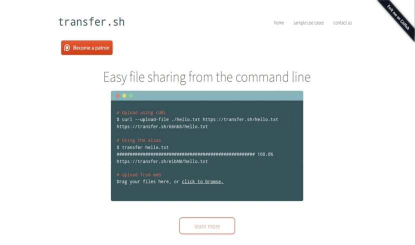

<!--
N.B.: This README was automatically generated by https://github.com/YunoHost/apps/tree/master/tools/README-generator
It shall NOT be edited by hand.
-->

# Transfer.sh for YunoHost

[](https://dash.yunohost.org/appci/app/transfersh)  

[](https://install-app.yunohost.org/?app=transfersh)

*[Lire ce readme en français.](./README_fr.md)*

> *This package allows you to install Transfer.sh quickly and simply on a YunoHost server.
If you don't have YunoHost, please consult [the guide](https://yunohost.org/#/install) to learn how to install it.*

## Overview

Easy and fast file sharing from the command-line. This code contains the server with everything you need to create your own instance.

Transfer.sh currently supports the s3 (Amazon S3), gdrive (Google Drive), storj (Storj) providers, and local file system (local).

### Features

- Made for use with shell
- Share files with a URL
- Unlimited upload
- Files stored forever
- Encrypt your files
- Maximize amount of downloads
- Preview your files in the browser


**Shipped version:** 1.4.0~ynh1

## Screenshots



## Disclaimers / important information

# Using the shell function

### Add alias to `.bashrc` or `.zshrc`

Copy and past this function into your `.bashrc` or `.zshrc` file.
Replace `domain.tld` by your transfersh domain

```
transfer(){ if [ $# -eq 0 ];then echo "No arguments specified.\nUsage:\n  transfer <file|directory>\n  ... | transfer <file_name>">&2;return 1;fi;if tty -s;then file="$1";file_name=$(basename "$file");if [ ! -e "$file" ];then echo "$file: No such file or directory">&2;return 1;fi;if [ -d "$file" ];then file_name="$file_name.zip" ,;(cd "$file"&&zip -r -q - .)|curl --progress-bar --upload-file "-" "https://domain.tld/$file_name"|tee /dev/null,;else cat "$file"|curl --progress-bar --upload-file "-" "https://domain.tld/$file_name"|tee /dev/null;fi;else file_name=$1;curl --progress-bar --upload-file "-" "https://domain.tld/$file_name"|tee /dev/null;fi;}
```
Now you can use transfer function

```
$ transfer hello.txt
```

### How to

https://github.com/dutchcoders/transfer.sh/blob/main/examples.md
## Documentation and resources

* Official app website: <https://transfer.sh/>
* Official admin documentation: <https://github.com/dutchcoders/transfer.sh/>
* Upstream app code repository: <https://github.com/dutchcoders/transfer.sh>
* YunoHost documentation for this app: <https://yunohost.org/app_transfersh>
* Report a bug: <https://github.com/YunoHost-Apps/transfersh_ynh/issues>

## Developer info

Please send your pull request to the [testing branch](https://github.com/YunoHost-Apps/transfersh_ynh/tree/testing).

To try the testing branch, please proceed like that.

``` bash
sudo yunohost app install https://github.com/YunoHost-Apps/transfersh_ynh/tree/testing --debug
or
sudo yunohost app upgrade transfersh -u https://github.com/YunoHost-Apps/transfersh_ynh/tree/testing --debug
```

**More info regarding app packaging:** <https://yunohost.org/packaging_apps>
