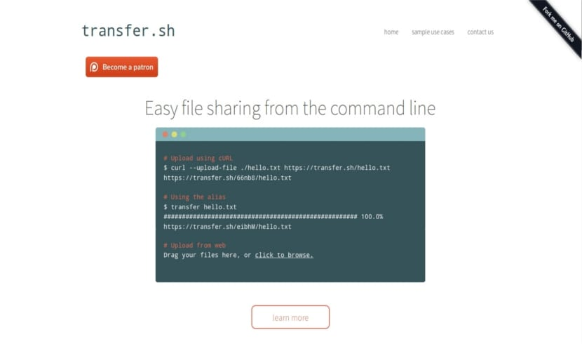

<!--
NB: Deze README is automatisch gegenereerd door <https://github.com/YunoHost/apps/tree/master/tools/readme_generator>
Hij mag NIET handmatig aangepast worden.
-->

# Transfer.sh voor Yunohost

[](https://ci-apps.yunohost.org/ci/apps/transfersh/)


[](https://install-app.yunohost.org/?app=transfersh)

*[Deze README in een andere taal lezen.](./ALL_README.md)*

> *Met dit pakket kun je Transfer.sh snel en eenvoudig op een YunoHost-server installeren.*  
> *Als je nog geen YunoHost hebt, lees dan [de installatiehandleiding](https://yunohost.org/install), om te zien hoe je 'm installeert.*

## Overzicht

Easy and fast file sharing from the command-line. This code contains the server with everything you need to create your own instance.
Transfer.sh currently supports the s3 (Amazon S3), gdrive (Google Drive), storj (Storj) providers, and local file system (local).

### Features

- Made for use with shell
- Share files with a URL
- Unlimited upload
- Files stored forever
- Encrypt your files
- Preview your files in the browser


**Geleverde versie:** 1.6.1~ynh2

## Schermafdrukken



## Documentatie en bronnen

- Officiele website van de app: <https://transfer.sh/>
- Officiele beheerdersdocumentatie: <https://github.com/dutchcoders/transfer.sh/>
- Upstream app codedepot: <https://github.com/dutchcoders/transfer.sh>
- YunoHost-store: <https://apps.yunohost.org/app/transfersh>
- Meld een bug: <https://github.com/YunoHost-Apps/transfersh_ynh/issues>

## Ontwikkelaarsinformatie

Stuur je pull request alsjeblieft naar de [`testing`-branch](https://github.com/YunoHost-Apps/transfersh_ynh/tree/testing).

Om de `testing`-branch uit te proberen, ga als volgt te werk:

```bash
sudo yunohost app install https://github.com/YunoHost-Apps/transfersh_ynh/tree/testing --debug
of
sudo yunohost app upgrade transfersh -u https://github.com/YunoHost-Apps/transfersh_ynh/tree/testing --debug
```

**Verdere informatie over app-packaging:** <https://yunohost.org/packaging_apps>
